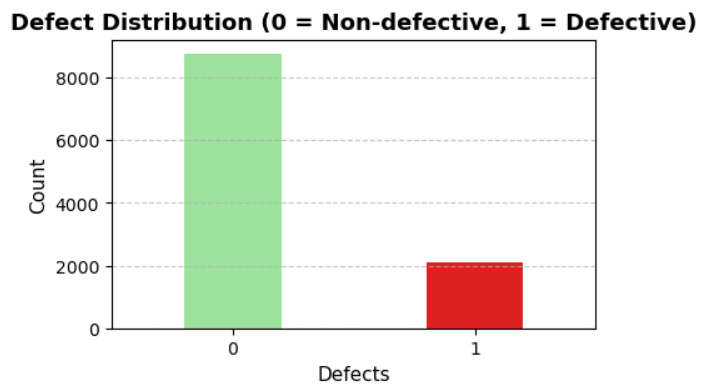
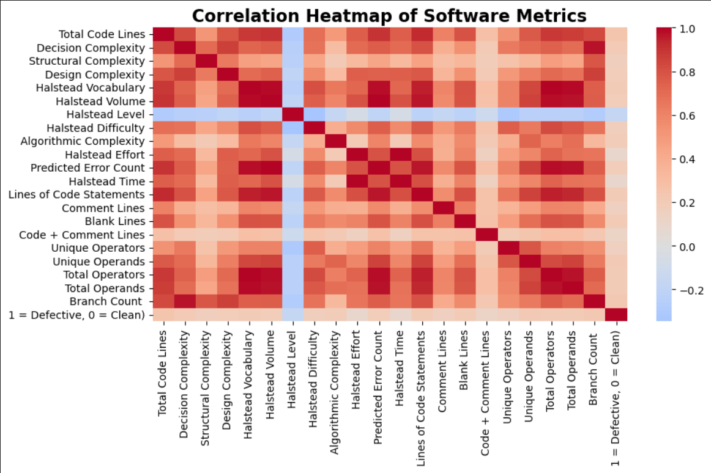
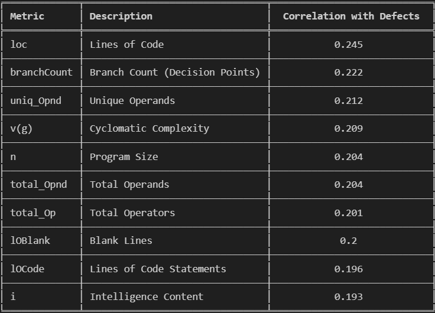
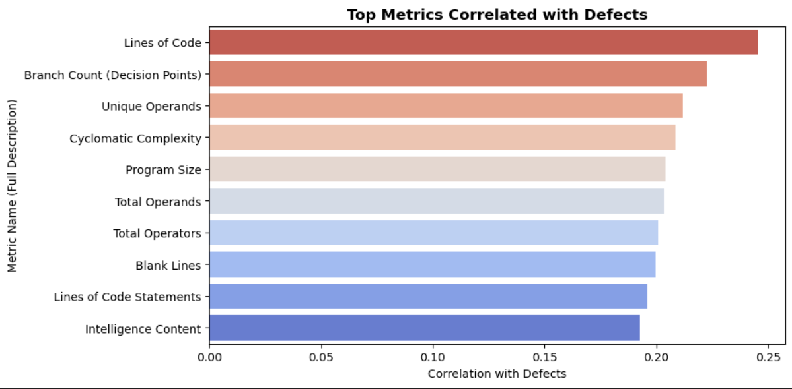
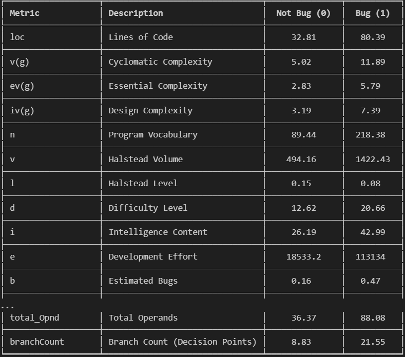
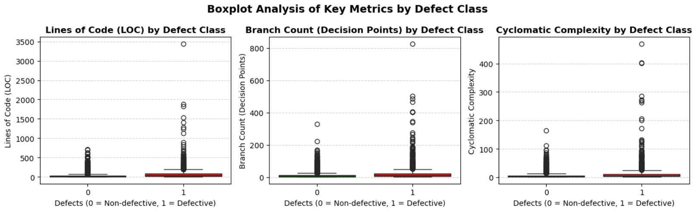

## 📊 Graph Analysis Summary ##

This study presents graphical evaluations supporting the data analysis process conducted on the NASA JM1 Software Defect Prediction Dataset.
The visualizations illustrate the relationships between various software metrics and defect presence, highlighting key patterns and trends.
This file contains insights and observations derived from each plotted figure.

## Defect Distribution Analysis

This bar chart illustrates the distribution of software modules based on their defect status — 0 = Non-defective, 1 = Defective.
It shows that the dataset is imbalanced, meaning there are significantly more non-defective modules than defective ones.
This imbalance is crucial for machine learning because it can cause the model to favor the majority class, reducing its ability to correctly predict defective modules.
Understanding this distribution helps determine whether data balancing techniques (such as oversampling, undersampling, or class weighting) should be applied before model training.

## Correlation Heatmap Analysis

The correlation heatmap provides a comprehensive view of how software complexity metrics relate to one another and to the defects variable within the NASA JM1 dataset.

Overall, the visualization reveals that most software metrics are strongly interrelated, indicating that as the size or complexity of the code increases, other metrics reflecting software effort, volume, and operations tend to rise simultaneously. This behavior highlights the intrinsic connection between code size, complexity, and maintainability.

## Specifically, the following insights can be derived:

High Positive Correlations:
Metrics such as loc (Lines of Code), v(g), ev(g), n, v, d, and e show strong positive correlations with each other and with the defects variable.
This indicates that larger and more complex code modules are more prone to defects.
In other words, as the number of lines and operations in the code increases, the likelihood of introducing errors also rises.

## Negative Correlation:
The l (Halstead Level) metric shows a negative relationship with most other variables.
This suggests that as code complexity grows, readability and simplicity (reflected by higher l values) decrease — meaning clearer and more understandable code tends to contain fewer defects.

## Weak or Neutral Correlations:
Metrics such as lOComment, lOBlank, and locCodeAndComment exhibit weak correlations with the rest.
These represent the documentation and commenting aspects of code, which vary independently of structural complexity and therefore do not strongly influence defect rates directly.

In summary, the correlation heatmap clearly demonstrates that defect occurrence in software modules is closely linked to code size and complexity.
Modules that are longer, denser, and involve more branching and operations are statistically more likely to contain bugs.
Conversely, well-structured, readable code shows a lower probability of defects.

## Top Metrics Correlated with Defects

This graph shows the metrics that have the strongest impact on software defects.
The analysis indicates that LOC (Lines of Code) has the highest positive correlation with defect rates. 
In other words, as the number of lines of code increases, the likelihood of defects tends to rise.

Following LOC, the branchCount, uniq_Opnd, and v(g) metrics also show a significant correlation with defects.
These metrics generally represent code complexity, branching structure, and operational diversity — meaning that higher values can make the code harder to maintain and increase the risk of defects.

## Mean Comparison (Mean by Defect Class)

This table compares the average metric values of defective (1) and non-defective (0) modules.
The results clearly show that defective modules have significantly higher average values across almost all metrics.

In particular, LOC (Lines of Code), v(g) (Cyclomatic Complexity), and branchCount stand out, with defective modules showing much higher averages than non-defective ones.
This indicates that as the length and complexity of the code increase, the likelihood of defects also rises.

In summary, the table demonstrates that software defects are strongly associated with code size and complexity level, supporting the conclusion that longer and more complex code tends to contain more errors.

## Boxplot Analysis of Key Metrics by Defect Class

The boxplot analysis visually compares key software metrics between defective (1) and non-defective (0) modules.
Across all three metrics — LOC (Lines of Code), branchCount, and v(g) (Cyclomatic Complexity) — defective modules show significantly higher median and wider distribution values.

This indicates that modules with more lines of code, greater branching, and higher complexity are more prone to defects.
In other words, as code size and structural complexity increase, the likelihood of defects also rises, supporting the earlier correlation and mean comparison results.

## Outlier (IQR) Analysis

_Analysis.png)

The IQR-based outlier analysis identifies modules with extreme metric values that deviate significantly from the majority of the dataset.
Metrics such as Total Operands (total_Opnd), Total Operators (total_Op), and Lines of Code (loc) have the highest number of outliers, indicating that some modules contain unusually large code bases or operational complexity compared to others.

These outliers are important because they can distort statistical summaries (like mean and variance) and may negatively impact model performance if left untreated.
By detecting them, we gain insights into which modules or files are exceptionally complex, and we can decide whether to normalize, cap, or exclude them in the preprocessing stage.

In summary, this analysis highlights that certain software components are disproportionately large or complex, confirming that code size and operational intensity are strong indicators of potential instability or defect risk.