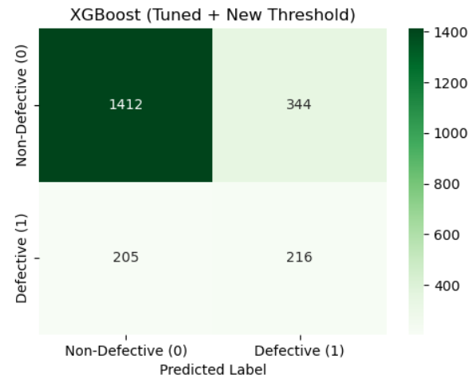
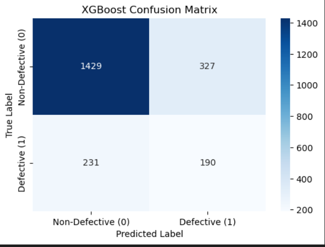
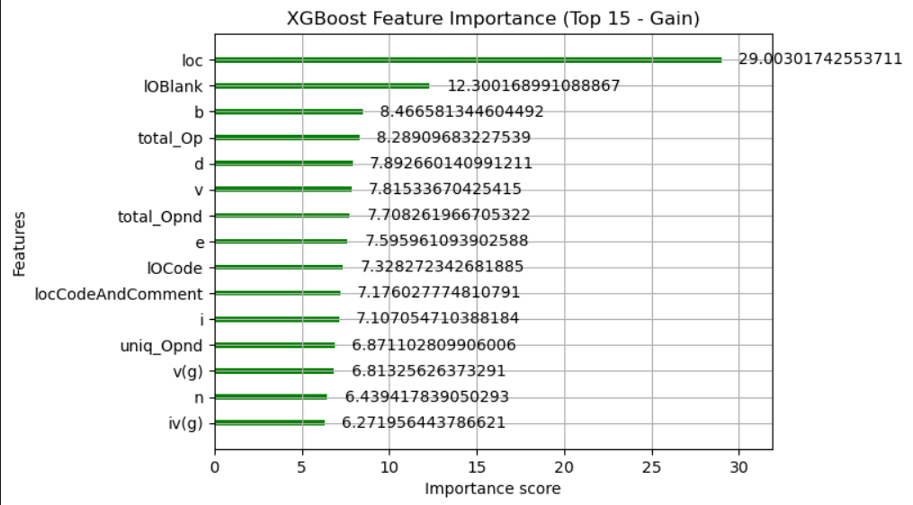
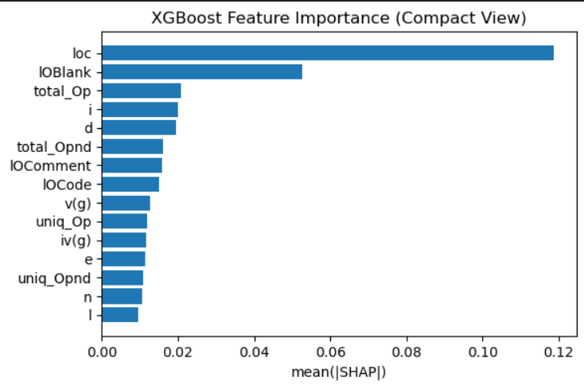

## Model Training Steps – NASA JM1 Defect Prediction

### 1) Overview

This document summarizes the training process built to predict defective software modules using NASA JM1 software metrics.
Compared models: XGBoost, Logistic Regression, SVM, Random Forest


### 2. Data & Split

**Dataset**  
- `jm1.csv`

**Target Variable**  
- `defects (0/1)`

**Data Split Method**  


train_test_split(test_size=0.2, random_state=42, stratify=y)

| Split         | Ratio | Description                     |
| :------------ | :---: | ------------------------------- |
| **Train Set** |  80%  | Used for model training         |
| **Test Set**  |  20%  | Used for performance evaluation |

> 🟢 **Comment:**  Stratified splitting ensured proportional representation of defective and non-defective modules in both sets.


### 3. Feature Engineering

The feature engineering process consisted of two main sets: **Set-A (Raw Metrics)** and **Set-B (Derived Ratios).**

---

**🧩 Set-A — Raw Metrics**  

Direct software metrics extracted from the NASA JM1 dataset:  
loc, v(g), iv(g), n, v, l, d, i, e, IOComment, IOBlank, ...


---

**⚙️ Set-B — Derived Ratios**  
Calculated features designed to capture relationships between code complexity, volume, and effort:

| Derived Feature       | Formula                              | Description |
|-----------------------|--------------------------------------|-------------|
| `loc_per_branch`      | `loc / (branchCount + 1)`            | Code volume per branch |
| `complexity_density`  | `v(g) / (loc + 1)`                   | Cyclomatic complexity per LOC |
| `effort_per_loc`      | `e / (loc + 1)`                      | Effort normalized by LOC |
| `difficulty_per_loc`  | `d / (loc + 1)`                      | Difficulty per LOC |
| `vocabulary_per_loc`  | `n / (loc + 1)`                      | Vocabulary size per LOC |
| `op_to_opnd_ratio`    | `total_Op / (total_Opnd + 1)`        | Operator-to-operand ratio |
| `uniq_op_ratio`       | `uniq_Op / (total_Op + 1)`           | Unique operator ratio |
| `uniq_opnd_ratio`     | `uniq_Opnd / (total_Opnd + 1)`       | Unique operand ratio |

---

**🧹 Data Cleaning & Scaling**  
- Missing values handled using `fillna(0)`  
- Standard scaling applied via `StandardScaler` *(only for Set-B models)*  

>  **Note:** Normalization improved model stability for Logistic Regression and SVM, while tree-based models (XGBoost, Random Forest) were trained on unscaled data.


### 4) Modeling

### 4.1 XGBoost (Set-A)

**Class Imbalance Handling**  
- Managed using `scale_pos_weight`

**Hyperparameter Tuning**  
- Performed with `RandomizedSearchCV`

**Best Parameters**

```json
{
  "subsample": 1.0,
  "scale_pos_weight": 4,
  "n_estimators": 400,
  "min_child_weight": 1,
  "max_depth": 8,
  "learning_rate": 0.01,
  "gamma": 0.3,
  "colsample_bytree": 1.0
} 
```

| Metric       |  Score |
| ------------ | :----: |
| **ROC-AUC**  | 0.7236 |
| **PR-AUC**   | 0.4053 |
| **Accuracy** | 0.7478 |

> 🟢 **Comment:** Best overall performance — strong balance between precision and recall with effective handling of class imbalance.

Confusion Matrix (tuned):

 


### 4.2 Logistic Regression (Set-B)

**Parameters**  
- `class_weight='balanced'`  
- `solver='lbfgs'`  

**Threshold & Results**  
- **F1-max threshold:** ≈ 0.540  

| Metric       | Score  |
|---------------|:------:|
| **ROC-AUC**   | 0.7064 |
| **PR-AUC**    | 0.4048 |
| **Accuracy**  | 0.7170 |

> 🟢 **Comment:** Balanced performance with simple implementation — stable and interpretable model.

---

### 4.3 SVM (RBF, Set-B)

**Parameters**  
- `class_weight='balanced'`  
- `probability=True`  

**Threshold & Results**  
- **F1-max threshold:** ≈ 0.208  

| Metric       | Score  |
|---------------|:------:|
| **ROC-AUC**   | 0.7005 |
| **PR-AUC**    | 0.3456 |
| **Accuracy**  | 0.6991 |

> 🟠 **Comment:** Good precision but weak recall — struggles with minority class detection.

---

### 4.4 Random Forest (Set-A)

**Parameters**  
- `n_estimators=400`  
- `class_weight='balanced'`  

**Results**  
| Metric     | Score  |
|-------------|:------:|
| **ROC-AUC** | 0.7162 |
| **PR-AUC**  | 0.4037 |
| **Accuracy**| 0.8025 |

> 🟢 **Comment:** Strong overall accuracy, but relatively lower recall for minority class.

---

### 4.5 Model Comparison (Test)

| Model                   | ROC-AUC | PR-AUC  | Notes                        |
|----------------------   |:-------:|:-------:|------------------------------|
| **XGBoost**             | 0.724   | 0.405   | Best overall balance         |
| **Logistic Regression** | 0.706   | 0.405   | Simple & effective           |
| **Random Forest**       | 0.716   | 0.404   | High accuracy, low recall    |
| **SVM (RBF)**           | 0.700   | 0.346   | Lower PR performance         |


### 5) Threshold Effect & Confusion Matrices

XGBoost (default threshold = 0.5) :



XGBoost (tuned threshold ≈ 0.347) :


Lowering the threshold increases recall for defective modules but slightly increases false positives.

### 6)  Feature Importance (Explainability)

**Model Explainability — XGBoost Feature Importance**

The XGBoost model’s interpretability was explored using both **Gain-based feature importance** and **SHAP value analysis**.

#### 🔹 Gain-Based Feature Importance
This chart ranks features according to their contribution to the model’s performance (based on *gain*).



Key influential metrics include:  
**`loc` (lines of code)**, **`IOBlank`**, **`total_Op`**, **`d` (difficulty)**, and **`v` (volume)** — these attributes contribute most to predicting defect-prone modules.

#### 🔹 SHAP Summary Analysis
The SHAP compact view highlights each feature’s average absolute impact on predictions, offering a more interpretable, model-agnostic view of importance.


 
Higher **`loc`** and **`IOBlank`** values significantly increase the predicted probability of a module being **defective**, indicating that larger, more complex, and less-commented code sections are riskier in terms of software quality.

>  **Interpretation:**  
> - *LOC* dominates as the primary risk factor for defects.  
> - *IOBlank* and *code complexity metrics* amplify defect likelihood.  
> - SHAP analysis confirms the same trend across multiple samples, providing confidence in feature stability and explainability.


### 7) Saved Artifacts

Model: xgb_final.pkl

Config: bug_predict_config.json (feature list, threshold, etc.)

Demo Notebook: bug_prediction_demo.ipynb

### 8) Execution

# Environment
pip install -r requirements.txt  # (xgboost, scikit-learn, shap, matplotlib, seaborn, pandas, numpy)

# Demo
jupyter notebook bug_prediction_demo.ipynb

### 9) Conclusion

XGBoost achieved the best overall trade-off between precision and recall.

For production use: XGBoost + F1-max threshold (≈0.347) + SHAP interpretability is recommended.

